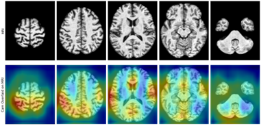

# MRI-based deep learning assessment of amyloid, tau, neurodegeneration (ATN) biomarker status in Alzheimer disease spectrum

This repository contains the source code and trained models for the research study titled MRI-based deep learning assessment of amyloid, tau, neurodegeneration (ATN) biomarker status in Alzheimer disease spectrum". 

Amyloid plaques, tau neurofibrillary tangles, and neurodegeneration represent the hallmark pathologies within the Alzheimer’s disease (AD) continuum. Biological markers of these pathologies constitute a subject’s ATN status, a framework proposed to biologically classify subjects for cognitive aging and dementia research. PET scans can be used as noninvasive markers of amyloid, tau, neurodegeneration (ATN) status but incur considerable cost and exposure to ionizing radiation. Conversely, routine MRI scans have limited use in characterizing ATN status. Deep learning techniques, such as convolutional neural networks, can detect complex patterns in MRI data, and have potential for noninvasive characterization of ATN status. The purpose of this study was to use deep learning to predict PET-determined ATN status using MRI and other readily available patient diagnostic data. 

## Prerequisites

The code contained in this repository can be run using Python 3 and was run in a docker container built using `dockerfile`.

## Usage

### Dataset

MRI and PET data were retrospectively collected from the Alzheimer’s Disease Imaging Initiative. PET scans were paired with MRI scans that were acquired within 30 days of each other from August 2005 to September 2020. A bimodal gaussian mixture model was used to threshold each biomarker’s values into positive and negative labels. MRI data were fed into a convolutional neural network to generate imaging features that were then combined with patient diagnostic data, including demographics, apolipoprotein E status, cognitive scores, hippocampal volumes, and clinical diagnosis, in a logistic regression model to classify each biomarker.

### Data Preparation

A detailed description with images of the data preparation pipeline can be found in `00_Data_Pipeline_Overview.ipynb`. `01_Pair_MRI_to_PET.ipynb` shows how PET and MRI scans were paired. `02_Create_Labels.ipynb` shows how the labels were created using the bimodal gaussian distribution. Since the ADNI dataset requires access to view, the sample output of the dataframes is hidden in each notebook. 

Other files within this repository were used during the steps of data processing or to support modeling. 

### Trained Models

The trained models for each biomarker, including the Combined-Model, Structured-Model, and MRI-Model, can be found online at https://duke.box.com/s/q2ov7quvv9n0mxa2nkbqds2w92n9doxi. 

